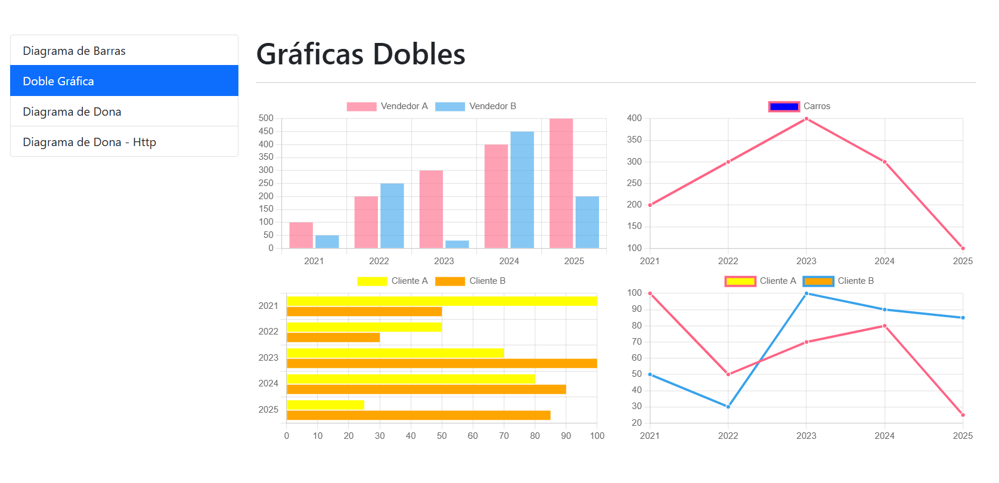

# GraphsApp

This project was generated with [Angular CLI](https://github.com/angular/angular-cli) version 15.2.11.



> Json-Server was implemented to create a fake REST API, for development and testing purposes.

## Implemented Dependencies: 
* json-server
```
npm i json-server
```

* ng2-charts
```
npm i --save ng2-charts@3.0.6
```

* chart.js
```
npm i --save chart.js@3.7.0
```


## Note: 
### Install dependencies for running this project
```
npm install
```

* Levantar el backend y ejecutar la app
```
npm run backend
ng serve -o
```
